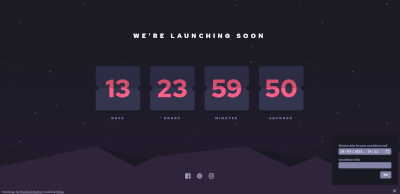

# 🪧 Frontend Mentor - Launch countdown timer solution

## 📋 About

This is a solution to the [Launch countdown timer challenge on Frontend Mentor](https://www.frontendmentor.io/challenges/launch-countdown-timer-N0XkGfyz-). Frontend Mentor challenges help you improve your coding skills by building realistic projects.

🌐 **Site published at**: [https://codevivi.github.io/launch-countdown-timer](https://codevivi.github.io/launch-countdown-timer)

**Solution URL**: Not Yet

🎯 **Goals:**

- Hover states for all interactive elements on the page
- Live countdown timer that ticks down every second (start the count at 14 days)
- **Bonus**: When a number changes, make the card flip from the middle
- Replicate target [mobile design](./challenge/design/mobile-design.jpg) (375px) as close as possible;
- Replicate target [desktop design](./challenge/design/desktop-design.jpg) (1440px) as close as possible;
- Replicate target [active states](./challenge/design/active-states.jpg) as close as possible;
- Follow [style guide](./challenge/style-guide.md)

**Extra features:**

- Set custom countdown date and title.

## Process

### 🧰 Building with

- Semantic HTML5 markup
- CSS
- JavaScript

## 👩‍💻 Author

Vilma Jovaišaitė

- [Github](https://github.com/codevivi)

- Frontend Mentor - [@codevivi](https://www.frontendmentor.io/profile/codevivi)
